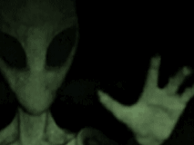
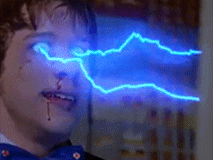
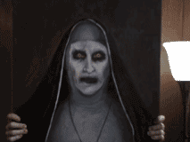
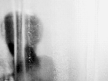
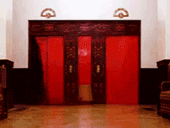
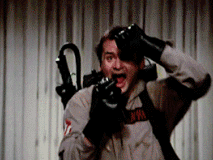
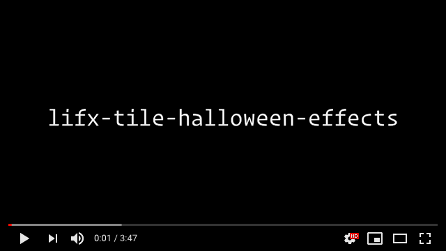

# lifx-tile-halloween-effects

A collection of Halloween inspired [LIFX Tile](https://www.lifx.com/collections/creative-tiles) effects. 🎃💀

## Contents

- [Requirements](#requirements)
- [Installation](#installation)
- [Usage](#usage)
- [Help](#help)
- [Effects](#effects)
- [Preview](#preview)
- [Credits](#credits)
- [License](#license)

## Requirements

- `node -v` >= v12.10.0
- `npm -v` >= 6.10.3
- One or more [LIFX Tiles](https://www.lifx.com/collections/creative-tiles) accessible via LAN

## Installation

```console
$ npm install
```

## Usage

```console
$ node lifx-tile-halloween-effects

? Choose an effect …
  alien
❯ blood
  eyes
  ghoul
  lightning
  nun
  psycho
  pumpkin
  scream
  shining
  slime

✔ Choose an effect · blood
Starting blood effect… (press [ctrl+c] to exit)
```

## Help

```console
$ node lifx-tile-halloween-effects --help

Usage: node lifx-tile-halloween-effects [options]

Options:
  --effect, -e   Effect name
       [string] [choices: "alien", "blood", "eyes", "ghoul", "lightning", "nun",
                              "psycho", "pumpkin", "scream", "shining", "slime"]
  --clear, -c    Clear device cache                                    [boolean]
  --verbose, -v  Show debug logs                                       [boolean]
  --version, -V  Show version number                                   [boolean]
  --help, -h     Show help                                             [boolean]

Examples:
  node lifx-tile-halloween-effects --effect alien

Credits:
  Copyright (c) James Furey (https://github.com/furey)
```

## Effects

### Alien

[](https://www.youtube.com/watch?g7TShjbeDuw&t=2s)

```console
$ node lifx-tile-halloween-effects -e alien
```

♫ Soundtrack Suggestion: [The X-Files Theme](https://youtu.be/j2d6T5G2rrY)

### Blood

[](https://www.youtube.com/watch?v=g7TShjbeDuw&t=25s)

```console
$ node lifx-tile-halloween-effects -e blood
```

♫ Soundtrack Suggestion: [Friday the 13th Theme](https://youtu.be/xR8oke8rzp8)

### Eyes

[](https://www.youtube.com/watch?v=g7TShjbeDuw&t=47s)

```console
$ node lifx-tile-halloween-effects -e eyes
```

♫ Soundtrack Suggestion: [Werewolf Ambience](https://youtu.be/wWIMQZjZY-E)

### Ghoul

[](https://www.youtube.com/watch?v=g7TShjbeDuw&t=68s)

```console
$ node lifx-tile-halloween-effects -e ghoul
```

♫ Soundtrack Suggestion: [The Exorcist Theme](https://youtu.be/1hbQpjYtbps)

### Lightning



```console
$ node lifx-tile-halloween-effects -e lightning
```

♫ Soundtrack Suggestion: [Lightning Ambience](https://youtu.be/2YpKlklYGE8)

### Nun

[](https://www.youtube.com/watch?v=g7TShjbeDuw&t=91s)

```console
$ node lifx-tile-halloween-effects -e nun
```

♫ Soundtrack Suggestion: [The Nun Theme](https://youtu.be/s4AF3q51Ius)

### Psycho

[](https://www.youtube.com/watch?v=g7TShjbeDuw&t=113s)

```console
$ node lifx-tile-halloween-effects -e psycho
```

♫ Soundtrack Suggestion: [Psycho Theme](https://youtu.be/Me-VhC9ieh0)

### Pumpkin

[](https://www.youtube.com/watch?v=g7TShjbeDuw&t=135s)

```console
$ node lifx-tile-halloween-effects -e pumpkin
```

♫ Soundtrack Suggestion: [Halloween Theme](https://youtu.be/pT4FY3NrhGg)

### Scream

[](https://www.youtube.com/watch?v=g7TShjbeDuw&t=157s)

```console
$ node lifx-tile-halloween-effects -e scream
```

♫ Soundtrack Suggestion: [Scream Theme](https://youtu.be/l4Rzp8_M_lU?t=109)

### Shining

[](https://www.youtube.com/watch?v=g7TShjbeDuw&t=179s)

```console
$ node lifx-tile-halloween-effects -e shining
```

♫ Soundtrack Suggestion: [The Shining Theme](https://youtu.be/g_nsZ8yt1KA)

### Slime

[](https://www.youtube.com/watch?v=g7TShjbeDuw&t=201s)

```console
$ node lifx-tile-halloween-effects -e slime
```

♫ Soundtrack Suggestion: [Ghostbusters Theme](https://youtu.be/9J9haehfQeg)

## Preview

[](https://www.youtube.com/watch?v=g7TShjbeDuw)

## Credits

This repo uses the [lifx-tile-effects-framework](https://github.com/furey/lifx-tile-effects-framework). 👨‍🔬💡

## License

ISC License

Copyright (c) 2019, James Furey

Permission to use, copy, modify, and/or distribute this software for any
purpose with or without fee is hereby granted, provided that the above
copyright notice and this permission notice appear in all copies.

THE SOFTWARE IS PROVIDED "AS IS" AND THE AUTHOR DISCLAIMS ALL WARRANTIES
WITH REGARD TO THIS SOFTWARE INCLUDING ALL IMPLIED WARRANTIES OF
MERCHANTABILITY AND FITNESS. IN NO EVENT SHALL THE AUTHOR BE LIABLE FOR
ANY SPECIAL, DIRECT, INDIRECT, OR CONSEQUENTIAL DAMAGES OR ANY DAMAGES
WHATSOEVER RESULTING FROM LOSS OF USE, DATA OR PROFITS, WHETHER IN AN
ACTION OF CONTRACT, NEGLIGENCE OR OTHER TORTIOUS ACTION, ARISING OUT OF
OR IN CONNECTION WITH THE USE OR PERFORMANCE OF THIS SOFTWARE.
